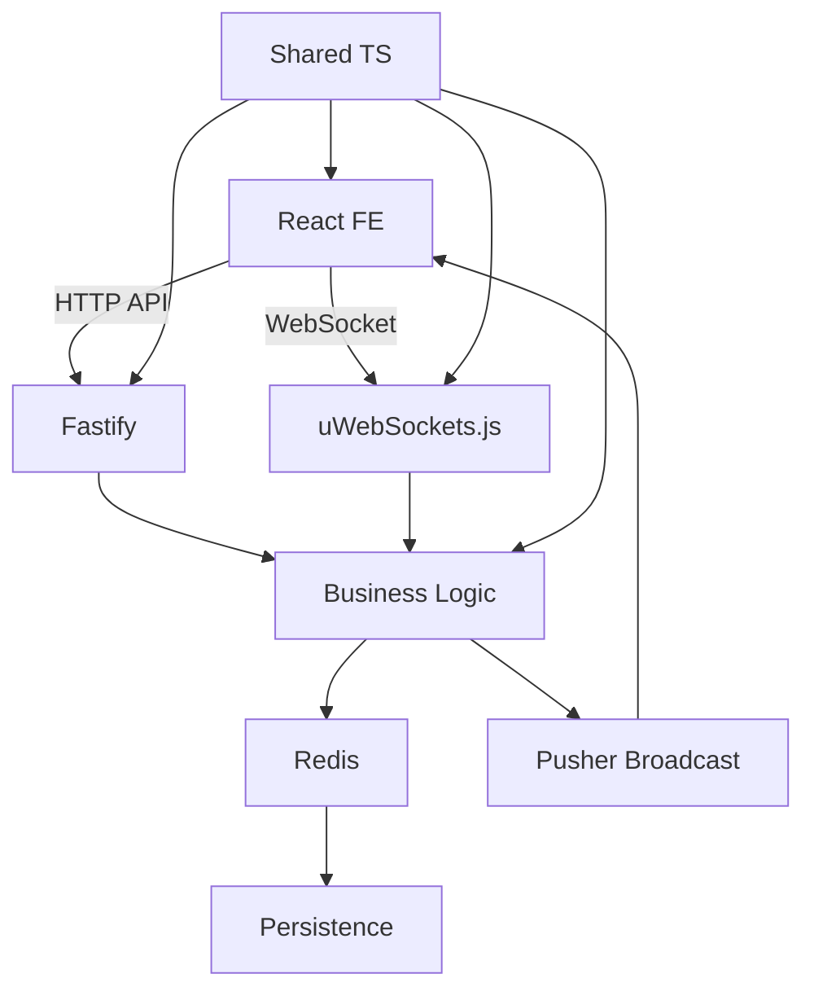
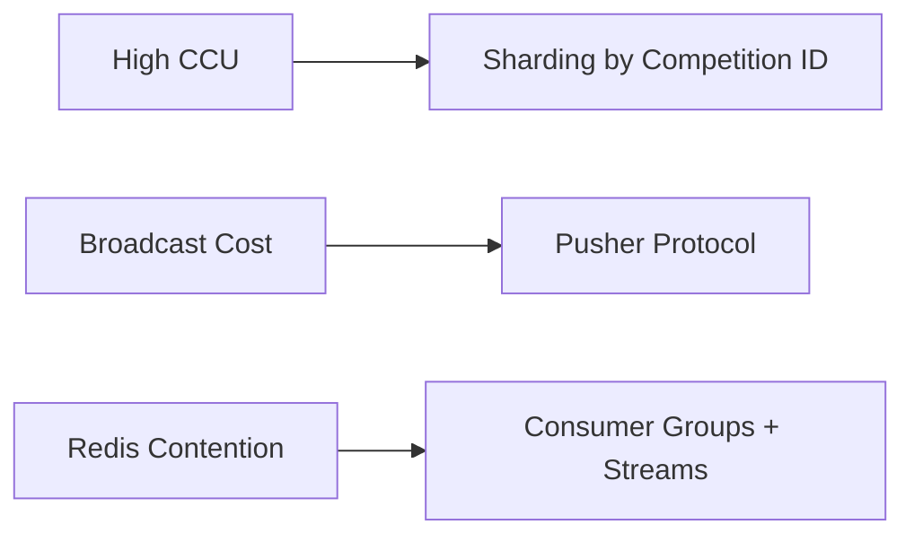
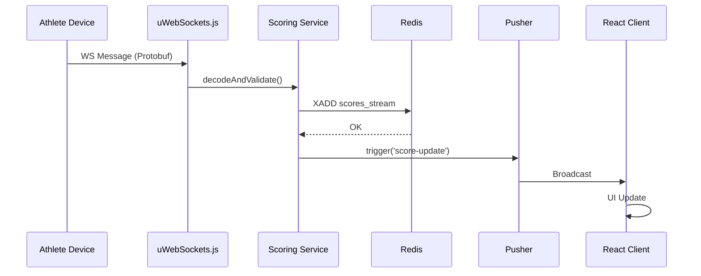

# Arsitektur & Implementasi: Fastify + uWebSockets.js + Redis + Pusher

## 1. Konteks Kebutuhan
- **Aplikasi:** Sistem scoring panahan (12.000 user, 1.000+ CCU realtime)
- **Spesifikasi Server:** 4-core/4GB RAM (minimal), optimasi untuk efisiensi
- **Kebutuhan Utama:**
  - Realtime scoring (<100ms latency)
  - Arsitektur monolith modular (monorepo)
  - Sustainabilitas 10+ tahun
  - Integrasi dengan FE React.js
- **Avoid:** Express + Template Engine (bottleneck realtime, arsitektur hybrid berantakan)

---

## 2. Arsitektur Inti



---

## 3. Komponen Kunci & Peran
| Komponen        | Peran                                 | Alasan Pemilihan                                                      |
|----------------|---------------------------------------|-----------------------------------------------------------------------|
| Fastify        | HTTP API layer (REST, GraphQL)         | Performa tinggi (28k req/dtk), plugin system, TypeScript-native       |
| uWebSockets.js | WebSocket engine realtime              | 4x lebih efisien vs Socket.IO (500k CCU/node), latensi ultra-rendah   |
| Redis          | State management, event streaming, cache| Throughput tinggi (1jt+ ops/dtk), struktur data fleksibel             |
| Pusher         | Broadcast massal (scoreboard, notifikasi)| Optimasi khusus fan-out, managed service (offload beban broadcast)    |
| Shared TS      | Kontrak FE-BE (types, DTOs, validators)| Konsistensi data, mengurangi bugs, kolaborasi tim lebih baik          |

---

## 4. Kapasitas & Skalabilitas
| Metrik                | Spesifikasi 4-core/4GB | Skala Horizontal                |
|-----------------------|------------------------|---------------------------------|
| Max Concurrent Users  | 500-700 CCU            | >1 juta CCU (dengan cluster)    |
| Realtime Throughput   | 5.000 msg/detik        | 1jt+ msg/detik                  |
| HTTP Throughput       | 10.000 req/detik       | 100k+ req/detik                 |
| Storage               | 30GB (50-100k event/hari)| Unlimited (cloud storage)      |

**Bottleneck Solution:**



---

## 5. Struktur Monorepo (Turborepo)

```
archery-app/
├── apps/
│   ├── client/       # React Vite (port 3000)
│   └── server/       # Fastify + uWS (port 8000)
├── packages/
│   ├── shared/       # TS types/utils
│   └── database/     # Redis + DB clients
├── turbo.json        # Build pipeline
└── docker-compose.yml
```

**Aturan Konsistensi:**
- **Layer Separation:** FE hanya konsumsi API (zero SSR); Modul BE: controller -> service -> repository
- **Strict Boundaries:**
  - ✅ Diperbolehkan: `import { ScoreEvent } from '@archery/shared';`
  - ❌ Dilarang: `import { ScoringService } from '../../../scoring';`

---

## 6. Alur Scoring Real-Time



**Optimasi Data:**

```protobuf
// Protobuf schema (60% lebih kecil vs JSON)
message ScoreEvent {
  required string athlete_id = 1;
  required int32 score = 2;
  optional bool is_x = 3 [default=false];
}
```

---

## 7. Konfigurasi Kritis Server 4GB RAM
| Komponen        | Konfigurasi                        | Dampak                    |
|-----------------|------------------------------------|---------------------------|
| Redis           | maxmemory 2500mb, allkeys-lru      | Cegah OOM killer          |
| uWebSockets.js  | maxPayloadLength: 512, idleTimeout: 30 | Hemat RAM & CPU      |
| Fastify         | bodyLimit: 1024, logger: false     | Minimize overhead         |
| Node.js         | NODE_OPTIONS="--max-old-space-size=3072" | Alokasi heap eksplisit |

---

## 8. Testing & Observability
**Strategi Testing:**
| Layer        | Tools                      | Target                |
|--------------|----------------------------|-----------------------|
| Unit         | Jest                       | 80% coverage          |
| Integration  | Supertest + Redis-mock     | Critical paths        |
| Load         | k6                         | 1.000 CCU simulation  |

**Metric Kunci:**
```bash
# Monitoring Command
redis-cli info memory | grep used_memory_human
cat /proc/loadavg | awk '{print $1}'
netstat -an | grep ESTABLISHED | wc -l
```

---

## 9. Roadmap 10 Tahun
| Tahun      | Fokus                | Target                                 |
|------------|----------------------|----------------------------------------|
| 2024-2026  | Modular Monolith     | 1.000 CCU stabil, shared core          |
| 2027-2029  | Service Decoupling   | Microservices untuk scoring engine     |
| 2030+      | Edge Computing       | Deploy di Cloudflare Workers           |

---

## 10. Kesimpulan & Action Plan
**Mengapa Stack Ini?**
- **Realtime Performance:** uWebSockets.js handle 500k msg/dtk vs Express (5k)
- **Cost Efficiency:** 500 CCU hanya butuh $10/bulan (vs NestJS $50+)
- **Maintainability:** Arsitektur modular + shared types
- **Future-proof:** Evolusi jelas ke microservices/edge

**Startup Commands:**
```bash
# 1. Inisialisasi monorepo
pnpm create turbo@latest archery-app --template with-fastify-react

# 2. Instal dependencies
cd archery-app
pnpm add uWebSockets.js ioredis @pusher/push-notifications-server protobufjs

# 3. Konfigurasi ENV
echo "REDIS_URL=localhost:6379" > apps/server/.env
echo "PUSHER_APP_ID=archery-scoring" >> apps/server/.env

# 4. Jalankan
pnpm dev
```

**Langkah Selanjutnya:**
- Implementasi modul scoring pertama
- Setup shared types (FE-BE)
- Konfigurasi CI/CD (GitHub Actions)
- Load testing dengan skenario 1.000 CCU

> "Arsitektur adalah investasi jangka panjang. Stack ini memberikan balance tepat antara performa, maintainability, dan biaya untuk kebutuhan 10 tahun ke depan."